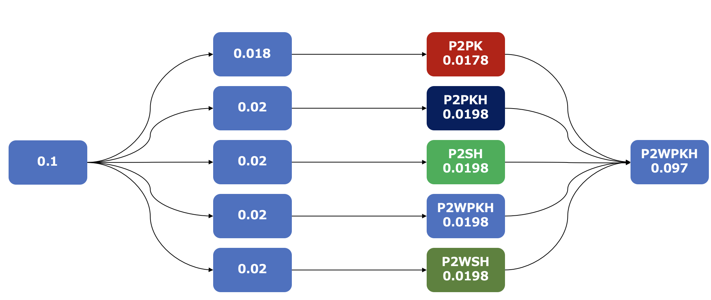

# 6章 ビットコインの仕組みの詳細


## 6.1 ビットコイン 発コミュニティとBIP

* [メーリングリスト bitcoin-devZ](https://lists.linuxfoundation.org/mailman/listinfo/bitcoin-dev)
* [Slack: https://bitcoincore.slack.com/](Slack: https://bitcoincore.slack.com/)
* [BIP](https://github.com/bitcoin/bips)


## 6.2 6.3 6.4 を一連の流れで演習します　(書籍の節の構成と異なっています)

事前に書籍の６章を通読しておいてください。


0. 事前にsignetのfaucet から0.1BTCビットコインを得ておきます。

1. faucetから得たUTXOをinputとして5個のoutputを持つトランザクションを作成し，署名して，ブロードキャストする

2. 5個のUTXOからそれぞれP2PK, P2PKH, P2SH, P2WPKH, P2WSH の５つのタイプのoutputを持つ5個のトランザクションを作成し，それぞれ署名して，ブロードキャストする
    3.1. P2PK のoutput を持つトランザクションの作成はバイナリ形式で作成する必要があります

3. 5個のタイプの異なるUTXOをinputとするトランザクションを作成
    3.1 P2SH, P2WSH のUTXOをワレットに認識させる必要があります。
4. トランザクションへの署名してブロードキャスト



## 6.2 トランザクションタイプと基本構造

### faucetから得たUTXOをinputとして5個のoutputを持つトランザクションを作成し，署名して，ブロードキャストする

1. ビットコインアドレスを５つ生成する
2. 使用するUTXOを確認する
2. ５つのoutputを持つトランザクションを作成する
3. 作成したトランザクションに署名する
4. 署名したトランザクションをブロードキャストする

```bash
# ビットコインアドレスを５つ生成する

bitcoin-core.cli getnewaddress
tb1qz9qum0j3th39wfmqsevyu59kmffmhsu69agu33

bitcoin-core.cli getnewaddress
tb1qq8725772xccjes5paehkvxrpg5a5gvx50an2m2

bitcoin-core.cli getnewaddress
tb1q668vf52sqv6rqshjqjr5qn25zen7lehzydj69x

bitcoin-core.cli getnewaddress
tb1qy986nrg0vtq4lyt6t2n9npm0auzrh0uc4gsv3x

bitcoin-core.cli getnewaddress
tb1qeh6j2hjdulv5ede0plqr5hk77g3jrhh08qy97f

```

```bash
# 使用するUTXOを確認する
##　"txid" と "vout"

bitcoin-core.cli listunspent
[
  {
    "txid": "7003aa2517c6b6c18e0f4d9dc51b4018456905e74f6a8e4fdd41e5ce4d89dcfb",
    "vout": 0,
    "address": "tb1qzdhc0u52q5k3p5mke2nqdsau5rytdr6q6m74gn",
    "label": "",
    "scriptPubKey": "0014136f87f28a052d10d376caa606c3bca0c8b68f40",
    "amount": 0.10000000,
    "confirmations": 259,
    "spendable": true,
    "solvable": true,
    "desc": "wpkh([60d80dee/0'/0'/0']029805218af17819d68ec23c11456606736c5a9b91b6cee591205e7e3f753e4aac)#r7lh6gny",
    "safe": true
  }
]

```

```bash
# ５つのoutputを持つトランザクションを作成する

bitcoin-core.cli createrawtransaction  '[{"txid":"7003aa2517c6b6c18e0f4d9dc51b4018456905e74f6a8e4fdd41e5ce4d89dcfb","vout":0}]' '[{"tb1qz9qum0j3th39wfmqsevyu59kmffmhsu69agu33":0.018}, {"tb1qq8725772xccjes5paehkvxrpg5a5gvx50an2m2":0.02},
{"tb1q668vf52sqv6rqshjqjr5qn25zen7lehzydj69x":0.02},
{"tb1qy986nrg0vtq4lyt6t2n9npm0auzrh0uc4gsv3x":0.02},
{"tb1qeh6j2hjdulv5ede0plqr5hk77g3jrhh08qy97f":0.02}]'

0200000001fbdc894dcee541dd4f8e6a4fe705694518401bc59d4d0f8ec1b6c61725aa03700000000000ffffffff0540771b00000000001600141141cdbe515de257276086584e50b6da53bbc39a80841e000000000016001401fcaa7bca36312cc281ee6f661861453b4430d480841e0000000000160014d68ec4d15003343042f20487404d541667efe6e280841e0000000000160014214fa98d0f62c15f917a5aa659876fef043bbf9880841e0000000000160014cdf5255e4de7d94cb72f0fc03a5edef22321deef00000000

```

```bash
# 作成したトランザクションに署名する

bitcoin-core.cli signrawtransactionwithwallet 0200000001fbdc894dcee541dd4f8e6a4fe705694518401bc59d4d0f8ec1b6c61725aa03700000000000ffffffff0540771b00000000001600141141cdbe515de257276086584e50b6da53bbc39a80841e000000000016001401fcaa7bca36312cc281ee6f661861453b4430d480841e0000000000160014d68ec4d15003343042f20487404d541667efe6e280841e0000000000160014214fa98d0f62c15f917a5aa659876fef043bbf9880841e0000000000160014cdf5255e4de7d94cb72f0fc03a5edef22321deef00000000

{
  "hex": "02000000000101fbdc894dcee541dd4f8e6a4fe705694518401bc59d4d0f8ec1b6c61725aa03700000000000ffffffff0540771b00000000001600141141cdbe515de257276086584e50b6da53bbc39a80841e000000000016001401fcaa7bca36312cc281ee6f661861453b4430d480841e0000000000160014d68ec4d15003343042f20487404d541667efe6e280841e0000000000160014214fa98d0f62c15f917a5aa659876fef043bbf9880841e0000000000160014cdf5255e4de7d94cb72f0fc03a5edef22321deef0247304402200b8cb96329e7f8af227b04edf9836a51e8690e3a8db493906dd57fc477b12db40220502e7fbd486aa6c815b061c1294a241d53387e51587a7cb4a58a4692fb199a480121029805218af17819d68ec23c11456606736c5a9b91b6cee591205e7e3f753e4aac00000000",
  "complete": true
}

# 内容の確認

bitcoin-core.cli decoderawtransaction 02000000000101fbdc894dcee541dd4f8e6a4fe705694518401bc59d4d0f8ec1b6c61725aa03700000000000ffffffff0540771b00000000001600141141cdbe515de257276086584e50b6da53bbc39a80841e000000000016001401fcaa7bca36312cc281ee6f661861453b4430d480841e0000000000160014d68ec4d15003343042f20487404d541667efe6e280841e0000000000160014214fa98d0f62c15f917a5aa659876fef043bbf9880841e0000000000160014cdf5255e4de7d94cb72f0fc03a5edef22321deef0247304402200b8cb96329e7f8af227b04edf9836a51e8690e3a8db493906dd57fc477b12db40220502e7fbd486aa6c815b061c1294a241d53387e51587a7cb4a58a4692fb199a480121029805218af17819d68ec23c11456606736c5a9b91b6cee591205e7e3f753e4aac00000000

{
  "txid": "b2352ac43e06e1ca2d3c0ba46e16b6e6543d30617a650661e3e8db7b292c4783",
  "hash": "fedafcb0f2385e7dcf266c6970758d7ba2b71c081fb8d8bb3f89a00a84aa9bfd",
  "version": 2,
  "size": 315,
  "vsize": 234,
  "weight": 933,
  "locktime": 0,
  "vin": [
    {
      "txid": "7003aa2517c6b6c18e0f4d9dc51b4018456905e74f6a8e4fdd41e5ce4d89dcfb",
      "vout": 0,
      "scriptSig": {
        "asm": "",
        "hex": ""
      },
      "txinwitness": [
        "304402200b8cb96329e7f8af227b04edf9836a51e8690e3a8db493906dd57fc477b12db40220502e7fbd486aa6c815b061c1294a241d53387e51587a7cb4a58a4692fb199a4801",
        "029805218af17819d68ec23c11456606736c5a9b91b6cee591205e7e3f753e4aac"
      ],
      "sequence": 4294967295
    }
  ],
  "vout": [
    {
      "value": 0.01800000,
      "n": 0,
      "scriptPubKey": {
        "asm": "0 1141cdbe515de257276086584e50b6da53bbc39a",
        "hex": "00141141cdbe515de257276086584e50b6da53bbc39a",
        "reqSigs": 1,
        "type": "witness_v0_keyhash",
        "addresses": [
          "tb1qz9qum0j3th39wfmqsevyu59kmffmhsu69agu33"
        ]
      }
    },
    {
      "value": 0.02000000,
      "n": 1,
      "scriptPubKey": {
        "asm": "0 01fcaa7bca36312cc281ee6f661861453b4430d4",
        "hex": "001401fcaa7bca36312cc281ee6f661861453b4430d4",
        "reqSigs": 1,
        "type": "witness_v0_keyhash",
        "addresses": [
          "tb1qq8725772xccjes5paehkvxrpg5a5gvx50an2m2"
        ]
      }
    },
    {
      "value": 0.02000000,
      "n": 2,
      "scriptPubKey": {
        "asm": "0 d68ec4d15003343042f20487404d541667efe6e2",
        "hex": "0014d68ec4d15003343042f20487404d541667efe6e2",
        "reqSigs": 1,
        "type": "witness_v0_keyhash",
        "addresses": [
          "tb1q668vf52sqv6rqshjqjr5qn25zen7lehzydj69x"
        ]
      }
    },
    {
      "value": 0.02000000,
      "n": 3,
      "scriptPubKey": {
        "asm": "0 214fa98d0f62c15f917a5aa659876fef043bbf98",
        "hex": "0014214fa98d0f62c15f917a5aa659876fef043bbf98",
        "reqSigs": 1,
        "type": "witness_v0_keyhash",
        "addresses": [
          "tb1qy986nrg0vtq4lyt6t2n9npm0auzrh0uc4gsv3x"
        ]
      }
    },
    {
      "value": 0.02000000,
      "n": 4,
      "scriptPubKey": {
        "asm": "0 cdf5255e4de7d94cb72f0fc03a5edef22321deef",
        "hex": "0014cdf5255e4de7d94cb72f0fc03a5edef22321deef",
        "reqSigs": 1,
        "type": "witness_v0_keyhash",
        "addresses": [
          "tb1qeh6j2hjdulv5ede0plqr5hk77g3jrhh08qy97f"
        ]
      }
    }
  ]
}
```

```bash
# 署名したトランザクションをブロードキャストする

bitcoin-core.cli sendrawtransaction 02000000000101fbdc894dcee541dd4f8e6a4fe705694518401bc59d4d0f8ec1b6c61725aa03700000000000ffffffff0540771b00000000001600141141cdbe515de257276086584e50b6da53bbc39a80841e000000000016001401fcaa7bca36312cc281ee6f661861453b4430d480841e0000000000160014d68ec4d15003343042f20487404d541667efe6e280841e0000000000160014214fa98d0f62c15f917a5aa659876fef043bbf9880841e0000000000160014cdf5255e4de7d94cb72f0fc03a5edef22321deef0247304402200b8cb96329e7f8af227b04edf9836a51e8690e3a8db493906dd57fc477b12db40220502e7fbd486aa6c815b061c1294a241d53387e51587a7cb4a58a4692fb199a480121029805218af17819d68ec23c11456606736c5a9b91b6cee591205e7e3f753e4aac00000000

b2352ac43e06e1ca2d3c0ba46e16b6e6543d30617a650661e3e8db7b292c4783

# 10分以上経過後，トランザクションがブロックに格納されたことを確認する

bitcoin-core.cli gettransaction b2352ac43e06e1ca2d3c0ba46e16b6e6543d30617a650661e3e8db7b292c4783

# UTXOのリストを確認する
bitcoin-core.cli listunspent

[
  {
    "txid": "b2352ac43e06e1ca2d3c0ba46e16b6e6543d30617a650661e3e8db7b292c4783",
    "vout": 0,
    "address": "tb1qz9qum0j3th39wfmqsevyu59kmffmhsu69agu33",
    "label": "alice",
    "scriptPubKey": "00141141cdbe515de257276086584e50b6da53bbc39a",
    "amount": 0.01800000,
    "confirmations": 376,
    "spendable": true,
    "solvable": true,
    "desc": "wpkh([60d80dee/0'/0'/16']030eff55e82dab5425b79bcd5469b3a19b5d7b95b0287bbd26ae528ec052beed3e)#3msrec96",
    "safe": true
  },
  {
    "txid": "b2352ac43e06e1ca2d3c0ba46e16b6e6543d30617a650661e3e8db7b292c4783",
    "vout": 1,
    "address": "tb1qq8725772xccjes5paehkvxrpg5a5gvx50an2m2",
    "label": "alice",
    "scriptPubKey": "001401fcaa7bca36312cc281ee6f661861453b4430d4",
    "amount": 0.02000000,
    "confirmations": 376,
    "spendable": true,
    "solvable": true,
    "desc": "wpkh([60d80dee/0'/0'/17']03052dbed2b03c9e9a788740134d40b962d0f4ef20600acb90a9093ed96e0e117e)#fjr3ae92",
    "safe": true
  },
  {
    "txid": "b2352ac43e06e1ca2d3c0ba46e16b6e6543d30617a650661e3e8db7b292c4783",
    "vout": 2,
    "address": "tb1q668vf52sqv6rqshjqjr5qn25zen7lehzydj69x",
    "label": "alice",
    "scriptPubKey": "0014d68ec4d15003343042f20487404d541667efe6e2",
    "amount": 0.02000000,
    "confirmations": 376,
    "spendable": true,
    "solvable": true,
    "desc": "wpkh([60d80dee/0'/0'/18']028edc7c6b857adcf3e14afc90ed841e496a53ef44f762fa5b30010a0a28a364c1)#vf6v6r2z",
    "safe": true
  },
  {
    "txid": "b2352ac43e06e1ca2d3c0ba46e16b6e6543d30617a650661e3e8db7b292c4783",
    "vout": 3,
    "address": "tb1qy986nrg0vtq4lyt6t2n9npm0auzrh0uc4gsv3x",
    "label": "alice",
    "scriptPubKey": "0014214fa98d0f62c15f917a5aa659876fef043bbf98",
    "amount": 0.02000000,
    "confirmations": 376,
    "spendable": true,
    "solvable": true,
    "desc": "wpkh([60d80dee/0'/0'/19']026da6a1cdb33a2480e09b2cee3f273e52a7e4cf2477b8144409687f78cc484d4d)#zwluf8lx",
    "safe": true
  },
  {
    "txid": "b2352ac43e06e1ca2d3c0ba46e16b6e6543d30617a650661e3e8db7b292c4783",
    "vout": 4,
    "address": "tb1qeh6j2hjdulv5ede0plqr5hk77g3jrhh08qy97f",
    "label": "alice",
    "scriptPubKey": "0014cdf5255e4de7d94cb72f0fc03a5edef22321deef",
    "amount": 0.02000000,
    "confirmations": 376,
    "spendable": true,
    "solvable": true,
    "desc": "wpkh([60d80dee/0'/0'/20']03d40d729a618dfd1fd41c633e08eada6d245d9234cf345efb0ab67baf820860b0)#jcs07qqr",
    "safe": true
  }
]
```

作成した５つのUTXOは，それぞれ順にP2PK,　P2PKH，P2SH，P2WPKH，P2WSHの作成実験のために使います。

### 5個のUTXOからそれぞれP2PK, P2PKH, P2SH, P2WPKH, P2WSH の５つのタイプのoutputを持つ5個のトランザクションを作成し，それぞれ署名して，ブロードキャストする

## 6.3 ビットコインアドレス

#### ビットコインアドレスの生成

```bash
getnewaddress <ラベル> <アドレスタイプ>
```

アドレスタイプ

* legacy
* bech32
* p2sh-segwit (後方互換のため，bech32アドレスをP2SHでラップしたアドレス)

### Bech32アドレス

```bash
bitcoin-core.cli getnewaddress alice bech32

tb1quk3jna5v87rpexc2c6j2jadczcuz4gsmqmffcp
```

### base52 アドレス

```bash
bitcoin-core.cli getnewaddress alice legacy

mtK2eEt7aWajvwJyuzuFG5yrGKfYyU3LMX
```

### マルチシグアドレスの生成（P2SH, P2WSHの例）

```
createmultisig <必要署名数> '[<公開鍵1>,<公開鍵2>,...,<公開鍵m>]' <アドレスタイプ>
```

アドレスタイプ

* legacy
* bech32
* p2sh-segwit (SegWit導入時の後方互換性維持のため，bech32アドレスをP2SHでラップしたアドレス)

#### アドレスごとの公開鍵の確認

マルチシグアドレスの生成には公開鍵が必要です。

```
getaddressinfo <ビットコインアドレス>
```
"pubkey": 公開鍵

* mwyP3Yk57aPoWjmH6h6eTSQscPAU55wF7H
    * 公開鍵:0396526c8055983750fc167752326c6c270d294da8f6b44444f1464d8454b9b50d
* mmhVgnijoaFnTnkqSxcFgV6mDTU38PoiaE
    * 公開鍵:0339dad2edb3c68888b332cf0e0e8159cfdf9acbefe8923082aaaf65ddc2f79f41
* mx3gd8r6k26mHosR55yz4ytn1XEjTVdQ7P
    * 公開鍵:024176a0784341d13a76ba8ad8a9249b1156b70216b4ebe2295eeafc0c0a3caf4d


* tb1qqdkw3a0vry8kf50f08z425d4lwxgl0ms0c5eyp
    * 公開鍵:0346711e7845d77b5dba283743228f5c6162e626445ae694fbd9962c6013775958
* tb1qrtqa7t3aytdw24p793kgyvqduldxf6njazkxqg
    * 公開鍵:03d798a0fc210729dab75473393296ed1c9ed8ec4ed85f97bb3273c9cb7b814476
* tb1q8uxaeukj8uaagz8e2lucpqwnl5rnxptkx6sgdu
    * 公開鍵:03e0e27add506965861763916b8daa3744d6136b2e4b6a1aeb9c4274deeb48e595

#### P2SH 用マルチシグアドレス

```
createmultisig <必要署名数> '[<公開鍵>, ..., <公開鍵>]' <アドレスタイプ>
```
結果
```
{                            (json object)
  "address" : "str",         (string) The value of the new multisig address.
  "redeemScript" : "hex",    (string) The string value of the hex-encoded redemption script.
  "descriptor" : "str"       (string) The descriptor for this multisig
}
```

legacy(公開鍵の順序が変わるとアドレスなども変わることに注意！)

1. "0396526c8055983750fc167752326c6c270d294da8f6b44444f1464d8454b9b50d"
2. "0339dad2edb3c68888b332cf0e0e8159cfdf9acbefe8923082aaaf65ddc2f79f41"
3. "024176a0784341d13a76ba8ad8a9249b1156b70216b4ebe2295eeafc0c0a3caf4d"


```json
bitcoin-core.cli createmultisig 2 '["0396526c8055983750fc167752326c6c270d294da8f6b44444f1464d8454b9b50d","0339dad2edb3c68888b332cf0e0e8159cfdf9acbefe8923082aaaf65ddc2f79f41","024176a0784341d13a76ba8ad8a9249b1156b70216b4ebe2295eeafc0c0a3caf4d"]' legacy


{
  "address": "2NFDXwLJm87sDmfosTivDkMUbw2Q8Ze8ktF",
  "redeemScript": "52210396526c8055983750fc167752326c6c270d294da8f6b44444f1464d8454b9b50d210339dad2edb3c68888b332cf0e0e8159cfdf9acbefe8923082aaaf65ddc2f79f4121024176a0784341d13a76ba8ad8a9249b1156b70216b4ebe2295eeafc0c0a3caf4d53ae",
  "descriptor": "sh(multi(2,0396526c8055983750fc167752326c6c270d294da8f6b44444f1464d8454b9b50d,0339dad2edb3c68888b332cf0e0e8159cfdf9acbefe8923082aaaf65ddc2f79f41,024176a0784341d13a76ba8ad8a9249b1156b70216b4ebe2295eeafc0c0a3caf4d))#qsun2edu"
}
```

* P2SH アドレス

```
2NFDXwLJm87sDmfosTivDkMUbw2Q8Ze8ktF
```

* redeemScript

```
52210396526c8055983750fc167752326c6c270d294da8f6b44444f1464d8454b9b50d210339dad2edb3c68888b332cf0e0e8159cfdf9acbefe8923082aaaf65ddc2f79f4121024176a0784341d13a76ba8ad8a9249b1156b70216b4ebe2295eeafc0c0a3caf4d53ae
```

* descriptor

```
"sh(multi(2,0396526c8055983750fc167752326c6c270d294da8f6b44444f1464d8454b9b50d,0339dad2edb3c68888b332cf0e0e8159cfdf9acbefe8923082aaaf65ddc2f79f41,024176a0784341d13a76ba8ad8a9249b1156b70216b4ebe2295eeafc0c0a3caf4d))#qsun2edu"
```

#### P2WSH用マルチシグアドレス

Bech32

1. "0346711e7845d77b5dba283743228f5c6162e626445ae694fbd9962c6013775958"
2. "03d798a0fc210729dab75473393296ed1c9ed8ec4ed85f97bb3273c9cb7b814476"
3. "03e0e27add506965861763916b8daa3744d6136b2e4b6a1aeb9c4274deeb48e595"

```json
bitcoin-core.cli createmultisig 2 '["0346711e7845d77b5dba283743228f5c6162e626445ae694fbd9962c6013775958","03d798a0fc210729dab75473393296ed1c9ed8ec4ed85f97bb3273c9cb7b814476","03e0e27add506965861763916b8daa3744d6136b2e4b6a1aeb9c4274deeb48e595"]' bech32


{
  "address": "tb1q8ngpnf4g4z95xfdv72m7hatc8yafna8dqcprd5psc7ue4sc7uzrs4avaje",
  "redeemScript": "52210346711e7845d77b5dba283743228f5c6162e626445ae694fbd9962c60137759582103d798a0fc210729dab75473393296ed1c9ed8ec4ed85f97bb3273c9cb7b8144762103e0e27add506965861763916b8daa3744d6136b2e4b6a1aeb9c4274deeb48e59553ae",
  "descriptor": "wsh(multi(2,0346711e7845d77b5dba283743228f5c6162e626445ae694fbd9962c6013775958,03d798a0fc210729dab75473393296ed1c9ed8ec4ed85f97bb3273c9cb7b814476,03e0e27add506965861763916b8daa3744d6136b2e4b6a1aeb9c4274deeb48e595))#p2l5aa90"
}
```

* P2WSHアドレス

```
tb1q8ngpnf4g4z95xfdv72m7hatc8yafna8dqcprd5psc7ue4sc7uzrs4avaje
```

* redeemScript

```
52210346711e7845d77b5dba283743228f5c6162e626445ae694fbd9962c60137759582103d798a0fc210729dab75473393296ed1c9ed8ec4ed85f97bb3273c9cb7b8144762103e0e27add506965861763916b8daa3744d6136b2e4b6a1aeb9c4274deeb48e59553ae
```

* descriptor

```
"wsh(multi(2,0346711e7845d77b5dba283743228f5c6162e626445ae694fbd9962c6013775958,03d798a0fc210729dab75473393296ed1c9ed8ec4ed85f97bb3273c9cb7b814476,03e0e27add506965861763916b8daa3744d6136b2e4b6a1aeb9c4274deeb48e595))#p2l5aa90"
```

## 6.4 トランザクションのタイプと検証スクリプト


### 6.4.1 P2PK（output）トランザクションの作成

（P2PKは難易度が高いので最後の6.4.6 にまわします）


### 6.4.2 P2PKH（output）トランザクションの作成

送金先アドレスを legacy なP2PKHにすればよい

```
bitcoin-core.cli getnewaddress alice legacy
msLvK34H6sL36oD32Vy58KX4myf7e7gnjG
```
* msLvK34H6sL36oD32Vy58KX4myf7e7gnjG


input(UTXO)　のJSON形式の例
```json
'[{"txid":"b2352ac43e06e1ca2d3c0ba46e16b6e6543d30617a650661e3e8db7b292c4783","vout":1}]' 
```

output のJSON形式の例
```json
'[{"msLvK34H6sL36oD32Vy58KX4myf7e7gnjG":0.0198}]'
```

未署名トランザクションの作成

```bash
bitcoin-core.cli createrawtransaction  '[{"txid":"b2352ac43e06e1ca2d3c0ba46e16b6e6543d30617a650661e3e8db7b292c4783","vout":1}]'  '[{"msLvK34H6sL36oD32Vy58KX4myf7e7gnjG":0.0198}]'


020000000183472c297bdbe8e36106657a61303d54e6b6166ea40b3c2dcae1063ec42a35b20100000000ffffffff0160361e00000000001976a91481bbb1c4c0db9739ca2daf11e32470e6a052cdaa88ac00000000
```

トランザクションへのデジタル署名（ワレットの秘密鍵を利用）

```
bitcoin-core.cli signrawtransactionwithwallet 020000000183472c297bdbe8e36106657a61303d54e6b6166ea40b3c2dcae1063ec42a35b20100000000ffffffff0160361e00000000001976a91481bbb1c4c0db9739ca2daf11e32470e6a052cdaa88ac00000000


{
  "hex": "0200000000010183472c297bdbe8e36106657a61303d54e6b6166ea40b3c2dcae1063ec42a35b20100000000ffffffff0160361e00000000001976a91481bbb1c4c0db9739ca2daf11e32470e6a052cdaa88ac024730440220187aa0885dad99420d07e6923f9f0e7005351d2a796fd4a733c15ff52eeacb50022070a8c096c64e85fa62820a805c710086a2f0b2b1414a81b7154bc318f827fded012103052dbed2b03c9e9a788740134d40b962d0f4ef20600acb90a9093ed96e0e117e00000000",
  "complete": true
}
```

作成したトランザクションの確認

voutのタイプを確認してください

```json
bitcoin-core.cli decoderawtransaction 0200000000010183472c297bdbe8e36106657a61303d54e6b6166ea40b3c2dcae1063ec42a35b20100000000ffffffff0160361e00000000001976a91481bbb1c4c0db9739ca2daf11e32470e6a052cdaa88ac024730440220187aa0885dad99420d07e6923f9f0e7005351d2a796fd4a733c15ff52eeacb50022070a8c096c64e85fa62820a805c710086a2f0b2b1414a81b7154bc318f827fded012103052dbed2b03c9e9a788740134d40b962d0f4ef20600acb90a9093ed96e0e117e00000000


{
  "txid": "01a4d2228d6264d9bbc5761b39671cc83e93ccce5141470f193829ae8cdd888a",
  "hash": "8d9dd644a6e457f57f8ffe8f67fabb590cfa60244fed0d744040ca09c9cca933",
  "version": 2,
  "size": 194,
  "vsize": 113,
  "weight": 449,
  "locktime": 0,
  "vin": [
    {
      "txid": "b2352ac43e06e1ca2d3c0ba46e16b6e6543d30617a650661e3e8db7b292c4783",
      "vout": 1,
      "scriptSig": {
        "asm": "",
        "hex": ""
      },
      "txinwitness": [
        "30440220187aa0885dad99420d07e6923f9f0e7005351d2a796fd4a733c15ff52eeacb50022070a8c096c64e85fa62820a805c710086a2f0b2b1414a81b7154bc318f827fded01",
        "03052dbed2b03c9e9a788740134d40b962d0f4ef20600acb90a9093ed96e0e117e"
      ],
      "sequence": 4294967295
    }
  ],
  "vout": [
    {
      "value": 0.01980000,
      "n": 0,
      "scriptPubKey": {
        "asm": "OP_DUP OP_HASH160 81bbb1c4c0db9739ca2daf11e32470e6a052cdaa OP_EQUALVERIFY OP_CHECKSIG",
        "hex": "76a91481bbb1c4c0db9739ca2daf11e32470e6a052cdaa88ac",
        "reqSigs": 1,
        "type": "pubkeyhash",
        "addresses": [
          "msLvK34H6sL36oD32Vy58KX4myf7e7gnjG"
        ]
      }
    }
  ]
}


```

### 6.4.3 P2SH（output）トランザクションの作成

送金先アドレスを 6.3 で生成した P2SH アドレスにすればよい

* 2NFDXwLJm87sDmfosTivDkMUbw2Q8Ze8ktF

* redeemScript

```
52210396526c8055983750fc167752326c6c270d294da8f6b44444f1464d8454b9b50d210339dad2edb3c68888b332cf0e0e8159cfdf9acbefe8923082aaaf65ddc2f79f4121024176a0784341d13a76ba8ad8a9249b1156b70216b4ebe2295eeafc0c0a3caf4d53ae
```

input(UTXO)　のJSON形式の例

```json
'[{"txid":"b2352ac43e06e1ca2d3c0ba46e16b6e6543d30617a650661e3e8db7b292c4783","vout":2}]' 
```

output のJSON形式の例

```json
'[{"2NFDXwLJm87sDmfosTivDkMUbw2Q8Ze8ktF":0.0198}]'
```

未署名トランザクションの作成

```bash
bitcoin-core.cli createrawtransaction  '[{"txid":"b2352ac43e06e1ca2d3c0ba46e16b6e6543d30617a650661e3e8db7b292c4783","vout":2}]'  '[{"2NFDXwLJm87sDmfosTivDkMUbw2Q8Ze8ktF":0.0198}]'


020000000183472c297bdbe8e36106657a61303d54e6b6166ea40b3c2dcae1063ec42a35b20200000000ffffffff0160361e000000000017a914f100eb22e91b65c5c24e3cb31fc6e571e57e10718700000000
```

トランザクションへのデジタル署名（ワレットの秘密鍵を利用）

```
bitcoin-core.cli signrawtransactionwithwallet 020000000183472c297bdbe8e36106657a61303d54e6b6166ea40b3c2dcae1063ec42a35b20200000000ffffffff0160361e000000000017a914f100eb22e91b65c5c24e3cb31fc6e571e57e10718700000000


{
  "hex": "0200000000010183472c297bdbe8e36106657a61303d54e6b6166ea40b3c2dcae1063ec42a35b20200000000ffffffff0160361e000000000017a914f100eb22e91b65c5c24e3cb31fc6e571e57e10718702473044022030e86cc52a0096fac0e21dc9437f0f53a91f82d4818580adcce06580685ae10b022037d89c72963f493707b7ad67c66c2f5892879cba108afcf2218cb4f58714f6e30121028edc7c6b857adcf3e14afc90ed841e496a53ef44f762fa5b30010a0a28a364c100000000",
  "complete": true
}
```

作成したトランザクションの確認

voutのタイプを確認してください

```json
bitcoin-core.cli decoderawtransaction 0200000000010183472c297bdbe8e36106657a61303d54e6b6166ea40b3c2dcae1063ec42a35b20200000000ffffffff0160361e000000000017a914f100eb22e91b65c5c24e3cb31fc6e571e57e10718702473044022030e86cc52a0096fac0e21dc9437f0f53a91f82d4818580adcce06580685ae10b022037d89c72963f493707b7ad67c66c2f5892879cba108afcf2218cb4f58714f6e30121028edc7c6b857adcf3e14afc90ed841e496a53ef44f762fa5b30010a0a28a364c100000000


{
  "txid": "fbe48c9501b3cd40e2799df464bea9d8f3f3c6bed36a71499636105af11508e9",
  "hash": "75a6310542e9908f9a3c571d09d433094fc8fde59e5b3557e7527b29609efd3e",
  "version": 2,
  "size": 192,
  "vsize": 111,
  "weight": 441,
  "locktime": 0,
  "vin": [
    {
      "txid": "b2352ac43e06e1ca2d3c0ba46e16b6e6543d30617a650661e3e8db7b292c4783",
      "vout": 2,
      "scriptSig": {
        "asm": "",
        "hex": ""
      },
      "txinwitness": [
        "3044022030e86cc52a0096fac0e21dc9437f0f53a91f82d4818580adcce06580685ae10b022037d89c72963f493707b7ad67c66c2f5892879cba108afcf2218cb4f58714f6e301",
        "028edc7c6b857adcf3e14afc90ed841e496a53ef44f762fa5b30010a0a28a364c1"
      ],
      "sequence": 4294967295
    }
  ],
  "vout": [
    {
      "value": 0.01980000,
      "n": 0,
      "scriptPubKey": {
        "asm": "OP_HASH160 f100eb22e91b65c5c24e3cb31fc6e571e57e1071 OP_EQUAL",
        "hex": "a914f100eb22e91b65c5c24e3cb31fc6e571e57e107187",
        "reqSigs": 1,
        "type": "scripthash",
        "addresses": [
          "2NFDXwLJm87sDmfosTivDkMUbw2Q8Ze8ktF"
        ]
      }
    }
  ]
}
```

### 6.4.4 P2WPKH（output）トランザクションの作成

送金先アドレスを　P2WPKH アドレスにすればよい

* tb1qz3uh04vpttfupqrh3msn4jkf694wmy7cfrtzrn


input(UTXO)　のJSON形式の例

```json
'[{"txid":"b2352ac43e06e1ca2d3c0ba46e16b6e6543d30617a650661e3e8db7b292c4783","vout":3}]' 
```

output のJSON形式の例

```json
'[{"tb1qz3uh04vpttfupqrh3msn4jkf694wmy7cfrtzrn":0.0198}]'
```

未署名トランザクションの作成

```bash
bitcoin-core.cli createrawtransaction  '[{"txid":"b2352ac43e06e1ca2d3c0ba46e16b6e6543d30617a650661e3e8db7b292c4783","vout":3}]' '[{"tb1qz3uh04vpttfupqrh3msn4jkf694wmy7cfrtzrn":0.0198}]'

020000000183472c297bdbe8e36106657a61303d54e6b6166ea40b3c2dcae1063ec42a35b20300000000ffffffff0160361e0000000000160014147977d5815ad3c080778ee13acac9d16aed93d800000000
```

トランザクションへのデジタル署名（ワレットの秘密鍵を利用）

```
bitcoin-core.cli signrawtransactionwithwallet 020000000183472c297bdbe8e36106657a61303d54e6b6166ea40b3c2dcae1063ec42a35b20300000000ffffffff0160361e0000000000160014147977d5815ad3c080778ee13acac9d16aed93d800000000

{
  "hex": "0200000000010183472c297bdbe8e36106657a61303d54e6b6166ea40b3c2dcae1063ec42a35b20300000000ffffffff0160361e0000000000160014147977d5815ad3c080778ee13acac9d16aed93d8024730440220092bc813dccd3bbe98f1586a34f49739362d4236e402b177c16dc715ccd9c56502202792454a0617da3aa5afc6774af4c961d41b007cf473f2a0ff7f8c475f2b7c740121026da6a1cdb33a2480e09b2cee3f273e52a7e4cf2477b8144409687f78cc484d4d00000000",
  "complete": true
}
```

voutのタイプを確認してください

```json
bitcoin-core.cli decoderawtransaction 0200000000010183472c297bdbe8e36106657a61303d54e6b6166ea40b3c2dcae1063ec42a35b20300000000ffffffff0160361e0000000000160014147977d5815ad3c080778ee13acac9d16aed93d8024730440220092bc813dccd3bbe98f1586a34f49739362d4236e402b177c16dc715ccd9c56502202792454a0617da3aa5afc6774af4c961d41b007cf473f2a0ff7f8c475f2b7c740121026da6a1cdb33a2480e09b2cee3f273e52a7e4cf2477b8144409687f78cc484d4d00000000


{
  "txid": "dd8173e708bed98cf6a66bc41bdada065e62d7eb57300115a60a42e35914b984",
  "hash": "cfb3516dcd4290ec81e01d619ac43187364682dd0b828e2a94c651ec0edfbe73",
  "version": 2,
  "size": 191,
  "vsize": 110,
  "weight": 437,
  "locktime": 0,
  "vin": [
    {
      "txid": "b2352ac43e06e1ca2d3c0ba46e16b6e6543d30617a650661e3e8db7b292c4783",
      "vout": 3,
      "scriptSig": {
        "asm": "",
        "hex": ""
      },
      "txinwitness": [
        "30440220092bc813dccd3bbe98f1586a34f49739362d4236e402b177c16dc715ccd9c56502202792454a0617da3aa5afc6774af4c961d41b007cf473f2a0ff7f8c475f2b7c7401",
        "026da6a1cdb33a2480e09b2cee3f273e52a7e4cf2477b8144409687f78cc484d4d"
      ],
      "sequence": 4294967295
    }
  ],
  "vout": [
    {
      "value": 0.01980000,
      "n": 0,
      "scriptPubKey": {
        "asm": "0 147977d5815ad3c080778ee13acac9d16aed93d8",
        "hex": "0014147977d5815ad3c080778ee13acac9d16aed93d8",
        "reqSigs": 1,
        "type": "witness_v0_keyhash",
        "addresses": [
          "tb1qz3uh04vpttfupqrh3msn4jkf694wmy7cfrtzrn"
        ]
      }
    }
  ]
}
```

### 6.4.5 P2WSH（output）トランザクションの作成

送金先アドレスを　6.3 で生成したP2WSH アドレスにすればよい

* tb1q8ngpnf4g4z95xfdv72m7hatc8yafna8dqcprd5psc7ue4sc7uzrs4avaje

* redeemScript

```
52210346711e7845d77b5dba283743228f5c6162e626445ae694fbd9962c60137759582103d798a0fc210729dab75473393296ed1c9ed8ec4ed85f97bb3273c9cb7b8144762103e0e27add506965861763916b8daa3744d6136b2e4b6a1aeb9c4274deeb48e59553ae
```


input(UTXO)　のJSON形式の例

```json
'[{"txid":"b2352ac43e06e1ca2d3c0ba46e16b6e6543d30617a650661e3e8db7b292c4783","vout":4}]' 
```

output のJSON形式の例

```json
'[{"tb1q8ngpnf4g4z95xfdv72m7hatc8yafna8dqcprd5psc7ue4sc7uzrs4avaje":0.0198}]'
```

未署名トランザクションの作成

```bash
bitcoin-core.cli createrawtransaction  '[{"txid":"b2352ac43e06e1ca2d3c0ba46e16b6e6543d30617a650661e3e8db7b292c4783","vout":4}]' '[{"tb1q8ngpnf4g4z95xfdv72m7hatc8yafna8dqcprd5psc7ue4sc7uzrs4avaje":0.0198}]'

020000000183472c297bdbe8e36106657a61303d54e6b6166ea40b3c2dcae1063ec42a35b20400000000ffffffff0160361e00000000002200203cd019a6a8a88b4325acf2b7ebf578393a99f4ed060236d030c7b99ac31ee08700000000
```

トランザクションへのデジタル署名（ワレットの秘密鍵を利用）

```
bitcoin-core.cli signrawtransactionwithwallet 020000000183472c297bdbe8e36106657a61303d54e6b6166ea40b3c2dcae1063ec42a35b20400000000ffffffff0160361e00000000002200203cd019a6a8a88b4325acf2b7ebf578393a99f4ed060236d030c7b99ac31ee08700000000

{
  "hex": "0200000000010183472c297bdbe8e36106657a61303d54e6b6166ea40b3c2dcae1063ec42a35b20400000000ffffffff0160361e00000000002200203cd019a6a8a88b4325acf2b7ebf578393a99f4ed060236d030c7b99ac31ee0870247304402200b2689214e8ae74af9db450069e80ea5136fb7dc9cd06399a546c45f3dcaa1ad022032250fea21e9f46eed4541a81ab260c3085e91798b2dff2b491403bd2bd624a8012103d40d729a618dfd1fd41c633e08eada6d245d9234cf345efb0ab67baf820860b000000000",
  "complete": true
}
```

作成したトランザクションの確認

voutのタイプを確認してください

```json
bitcoin-core.cli decoderawtransaction 0200000000010183472c297bdbe8e36106657a61303d54e6b6166ea40b3c2dcae1063ec42a35b20400000000ffffffff0160361e00000000002200203cd019a6a8a88b4325acf2b7ebf578393a99f4ed060236d030c7b99ac31ee0870247304402200b2689214e8ae74af9db450069e80ea5136fb7dc9cd06399a546c45f3dcaa1ad022032250fea21e9f46eed4541a81ab260c3085e91798b2dff2b491403bd2bd624a8012103d40d729a618dfd1fd41c633e08eada6d245d9234cf345efb0ab67baf820860b000000000

{
  "txid": "95ccd50a75ab3bb3767df0b7669f3472965f8d1598feab7cb424f1862857ca8f",
  "hash": "1dff3a9dc26deeb9db625e6b743146b41e34a97e9bba94f12662b2a8bc0b4a79",
  "version": 2,
  "size": 203,
  "vsize": 122,
  "weight": 485,
  "locktime": 0,
  "vin": [
    {
      "txid": "b2352ac43e06e1ca2d3c0ba46e16b6e6543d30617a650661e3e8db7b292c4783",
      "vout": 4,
      "scriptSig": {
        "asm": "",
        "hex": ""
      },
      "txinwitness": [
        "304402200b2689214e8ae74af9db450069e80ea5136fb7dc9cd06399a546c45f3dcaa1ad022032250fea21e9f46eed4541a81ab260c3085e91798b2dff2b491403bd2bd624a801",
        "03d40d729a618dfd1fd41c633e08eada6d245d9234cf345efb0ab67baf820860b0"
      ],
      "sequence": 4294967295
    }
  ],
  "vout": [
    {
      "value": 0.01980000,
      "n": 0,
      "scriptPubKey": {
        "asm": "0 3cd019a6a8a88b4325acf2b7ebf578393a99f4ed060236d030c7b99ac31ee087",
        "hex": "00203cd019a6a8a88b4325acf2b7ebf578393a99f4ed060236d030c7b99ac31ee087",
        "reqSigs": 1,
        "type": "witness_v0_scripthash",
        "addresses": [
          "tb1q8ngpnf4g4z95xfdv72m7hatc8yafna8dqcprd5psc7ue4sc7uzrs4avaje"
        ]
      }
    }
  ]
}
```

### 6.4.6 P2PK（output）トランザクションの作成

bitcoin core のAPIでは　P2PKのトランザクション作成機能は削除されているので，自分でトランザクションの内容を仕様にそって自作する必要があります。

* input がポイントするUTXOのTXIDはリトルエンディアン
* ScriptPubkeyの最後の１バイトは， OP_CHECKSIG (コードは16進数で "ac")
* valueの値は送金金額の単位が 1億分の1 BTC = 1 satoshi
* valueの値は 8バイトのリトルエンディアンであることに注意が必要です。

#### リトルエンディアン変換

Rubyのビッグエンディアンからリトルエンディアンへの変換プログラム

```ruby
be =  "00000000001de840"
le=[be].pack('H*').reverse.unpack('H*')[0]
"40e81d0000000000"
```

outputのvalue: 0.0178 BTC

```
0.0178 btc=1780000 satoshi 
8バイトの16進数では，00000000001b2920
8バイトのリトルエンディアン表現にすると
20291b0000000000
```


* トランザクション

|フィールド|内容|
|:--|:--|
|version| 02000000|
|inputの数|01|
|input||
|outputの数|01|
|output||
|nLocTime| 00000000 |

トランザクションデータの連結結果

```
02000000
01<input>
01<output>
00000000
```

input (UTXO)

* b2352ac43e06e1ca2d3c0ba46e16b6e6543d30617a650661e3e8db7b292c4783
*  "83472c297bdbe8e36106657a61303d54e6b6166ea40b3c2dcae1063ec42a35b2"(リトルエンディアン)
* vout:0

|フィールド|内容|
|:--|:--|
|トランザクションID| 83472c297bdbe8e36106657a61303d54e6b6166ea40b3c2dcae1063ec42a35b2 |
|txout index|0000000000|
|ScriptSigサイズ|空|
| ScriptSig |空|
|nSequence|ffffffff|


inputデータの連結結果

```
83472c297bdbe8e36106657a61303d54e6b6166ea40b3c2dcae1063ec42a35b20000000000ffffffff
```

* output 


|フィールド|内容|
|:--|:--|
|value| 20291b0000000000 |
|scriputPubKeyのバイト数| 23|
|scriputPubKey|21(公開鍵のバイト数 16進数）|
|送金先公開鍵| 027544b898d2d886a7ee733f2cf3da01bfd5d2350fedf602f4d1b78412b5f4d851|
| OP_CHECKSIG| ac|


outputデータの連結結果

```
20291b00000000002321027544b898d2d886a7ee733f2cf3da01bfd5d2350fedf602f4d1b78412b5f4d851ac
```

トランザクションの作成

```
02000000
0183472c297bdbe8e36106657a61303d54e6b6166ea40b3c2dcae1063ec42a35b20000000000ffffffff
0120291b00000000002321027544b898d2d886a7ee733f2cf3da01bfd5d2350fedf602f4d1b78412b5f4d851ac
00000000
```

```
bitcoin-core.cli decoderawtransaction 020000000183472c297bdbe8e36106657a61303d54e6b6166ea40b3c2dcae1063ec42a35b20000000000ffffffff0120291b00000000002321027544b898d2d886a7ee733f2cf3da01bfd5d2350fedf602f4d1b78412b5f4d851ac00000000

{
  "txid": "01c041f15baaf8e75d09d24335be445fae39d322688788be1556f5436fe3dbbb",
  "hash": "01c041f15baaf8e75d09d24335be445fae39d322688788be1556f5436fe3dbbb",
  "version": 2,
  "size": 95,
  "vsize": 95,
  "weight": 380,
  "locktime": 0,
  "vin": [
    {
      "txid": "b2352ac43e06e1ca2d3c0ba46e16b6e6543d30617a650661e3e8db7b292c4783",
      "vout": 0,
      "scriptSig": {
        "asm": "",
        "hex": ""
      },
      "sequence": 4294967295
    }
  ],
  "vout": [
    {
      "value": 0.01780000,
      "n": 0,
      "scriptPubKey": {
        "asm": "027544b898d2d886a7ee733f2cf3da01bfd5d2350fedf602f4d1b78412b5f4d851 OP_CHECKSIG",
        "hex": "21027544b898d2d886a7ee733f2cf3da01bfd5d2350fedf602f4d1b78412b5f4d851ac",
        "type": "pubkey"
      }
    }
  ]
}
```


作成したトランザクションへの署名

```
bitcoin-core.cli signrawtransactionwithwallet 020000000183472c297bdbe8e36106657a61303d54e6b6166ea40b3c2dcae1063ec42a35b20000000000ffffffff0120291b00000000002321027544b898d2d886a7ee733f2cf3da01bfd5d2350fedf602f4d1b78412b5f4d851ac00000000


{
  "hex": "0200000000010183472c297bdbe8e36106657a61303d54e6b6166ea40b3c2dcae1063ec42a35b20000000000ffffffff0120291b00000000002321027544b898d2d886a7ee733f2cf3da01bfd5d2350fedf602f4d1b78412b5f4d851ac0247304402201fdc6bb70a878b941adb30a094fd35ca43964ede720b252eb93b08a7f3e9343f02203cc5a937275278dafb515a3b45ebd29c8603dbb324ca0d7f618cdf833bb20e9c0121030eff55e82dab5425b79bcd5469b3a19b5d7b95b0287bbd26ae528ec052beed3e00000000",
  "complete": true
}

```

作成したトランザクションの確認

voutのタイプを確認してください

```json
bitcoin-core.cli decoderawtransaction 0200000000010183472c297bdbe8e36106657a61303d54e6b6166ea40b3c2dcae1063ec42a35b20000000000ffffffff0120291b00000000002321027544b898d2d886a7ee733f2cf3da01bfd5d2350fedf602f4d1b78412b5f4d851ac0247304402201fdc6bb70a878b941adb30a094fd35ca43964ede720b252eb93b08a7f3e9343f02203cc5a937275278dafb515a3b45ebd29c8603dbb324ca0d7f618cdf833bb20e9c0121030eff55e82dab5425b79bcd5469b3a19b5d7b95b0287bbd26ae528ec052beed3e00000000


{
  "txid": "01c041f15baaf8e75d09d24335be445fae39d322688788be1556f5436fe3dbbb",
  "hash": "2fe3f6a705ef89f00a946e0b8da14e70e4705a33a96eda7a72c817d529623938",
  "version": 2,
  "size": 204,
  "vsize": 123,
  "weight": 489,
  "locktime": 0,
  "vin": [
    {
      "txid": "b2352ac43e06e1ca2d3c0ba46e16b6e6543d30617a650661e3e8db7b292c4783",
      "vout": 0,
      "scriptSig": {
        "asm": "",
        "hex": ""
      },
      "txinwitness": [
        "304402201fdc6bb70a878b941adb30a094fd35ca43964ede720b252eb93b08a7f3e9343f02203cc5a937275278dafb515a3b45ebd29c8603dbb324ca0d7f618cdf833bb20e9c01",
        "030eff55e82dab5425b79bcd5469b3a19b5d7b95b0287bbd26ae528ec052beed3e"
      ],
      "sequence": 4294967295
    }
  ],
  "vout": [
    {
      "value": 0.01780000,
      "n": 0,
      "scriptPubKey": {
        "asm": "027544b898d2d886a7ee733f2cf3da01bfd5d2350fedf602f4d1b78412b5f4d851 OP_CHECKSIG",
        "hex": "21027544b898d2d886a7ee733f2cf3da01bfd5d2350fedf602f4d1b78412b5f4d851ac",
        "type": "pubkey"
      }
    }
  ]
}
```

### 6.4.7 5つのトランザクションをブロードキャストする

トランザクションの内容をよく確認してください。

```bash
# P2PK
bitcoin-core.cli sendrawtransaction 0200000000010183472c297bdbe8e36106657a61303d54e6b6166ea40b3c2dcae1063ec42a35b20000000000ffffffff0120291b00000000002321027544b898d2d886a7ee733f2cf3da01bfd5d2350fedf602f4d1b78412b5f4d851ac0247304402201fdc6bb70a878b941adb30a094fd35ca43964ede720b252eb93b08a7f3e9343f02203cc5a937275278dafb515a3b45ebd29c8603dbb324ca0d7f618cdf833bb20e9c0121030eff55e82dab5425b79bcd5469b3a19b5d7b95b0287bbd26ae528ec052beed3e00000000

TXID
01c041f15baaf8e75d09d24335be445fae39d322688788be1556f5436fe3dbbb

# P2PKH
bitcoin-core.cli sendrawtransaction 0200000000010183472c297bdbe8e36106657a61303d54e6b6166ea40b3c2dcae1063ec42a35b20100000000ffffffff0160361e00000000001976a91481bbb1c4c0db9739ca2daf11e32470e6a052cdaa88ac024730440220187aa0885dad99420d07e6923f9f0e7005351d2a796fd4a733c15ff52eeacb50022070a8c096c64e85fa62820a805c710086a2f0b2b1414a81b7154bc318f827fded012103052dbed2b03c9e9a788740134d40b962d0f4ef20600acb90a9093ed96e0e117e00000000

TXID
01a4d2228d6264d9bbc5761b39671cc83e93ccce5141470f193829ae8cdd888a

# P2SH
bitcoin-core.cli sendrawtransaction 0200000000010183472c297bdbe8e36106657a61303d54e6b6166ea40b3c2dcae1063ec42a35b20200000000ffffffff0160361e000000000017a914f100eb22e91b65c5c24e3cb31fc6e571e57e10718702473044022030e86cc52a0096fac0e21dc9437f0f53a91f82d4818580adcce06580685ae10b022037d89c72963f493707b7ad67c66c2f5892879cba108afcf2218cb4f58714f6e30121028edc7c6b857adcf3e14afc90ed841e496a53ef44f762fa5b30010a0a28a364c100000000

TXID
fbe48c9501b3cd40e2799df464bea9d8f3f3c6bed36a71499636105af11508e9

# P2WPKH
bitcoin-core.cli sendrawtransaction 0200000000010183472c297bdbe8e36106657a61303d54e6b6166ea40b3c2dcae1063ec42a35b20300000000ffffffff0160361e0000000000160014147977d5815ad3c080778ee13acac9d16aed93d8024730440220092bc813dccd3bbe98f1586a34f49739362d4236e402b177c16dc715ccd9c56502202792454a0617da3aa5afc6774af4c961d41b007cf473f2a0ff7f8c475f2b7c740121026da6a1cdb33a2480e09b2cee3f273e52a7e4cf2477b8144409687f78cc484d4d00000000

TXID
dd8173e708bed98cf6a66bc41bdada065e62d7eb57300115a60a42e35914b984

# P2WSH
bitcoin-core.cli sendrawtransaction 0200000000010183472c297bdbe8e36106657a61303d54e6b6166ea40b3c2dcae1063ec42a35b20400000000ffffffff0160361e00000000002200203cd019a6a8a88b4325acf2b7ebf578393a99f4ed060236d030c7b99ac31ee0870247304402200b2689214e8ae74af9db450069e80ea5136fb7dc9cd06399a546c45f3dcaa1ad022032250fea21e9f46eed4541a81ab260c3085e91798b2dff2b491403bd2bd624a8012103d40d729a618dfd1fd41c633e08eada6d245d9234cf345efb0ab67baf820860b000000000

TXID
95ccd50a75ab3bb3767df0b7669f3472965f8d1598feab7cb424f1862857ca8f
```

ビットコインネットワークで確認され，ブロックに格納されるまで10分以上待ってください。

### 6.4.8 5種類のUTXOを消費するトランザクションの作成

#### UTXOの確認

この時点で　bitcoin core のワレット機能でUTXOとして確認可能なものは　P2PK, P2PKH, P2WPKH のoutputだけです。

P2SHとP2WSHのUTXOは，ワレットには認識されません。

```
bitcoin-core.cli listunspent
[
  {
    "txid": "dd8173e708bed98cf6a66bc41bdada065e62d7eb57300115a60a42e35914b984",
    "vout": 0,
    "address": "tb1qz3uh04vpttfupqrh3msn4jkf694wmy7cfrtzrn",
    "label": "",
    "scriptPubKey": "0014147977d5815ad3c080778ee13acac9d16aed93d8",
    "amount": 0.01980000,
    "confirmations": 208,
    "spendable": true,
    "solvable": true,
    "desc": "wpkh([60d80dee/0'/0'/34']0307de5755de6328a3d68a60a342128326d996271b251c7ab11cedcaf972a1f36c)#njlw3azr",
    "safe": true
  },
  {
    "txid": "01a4d2228d6264d9bbc5761b39671cc83e93ccce5141470f193829ae8cdd888a",
    "vout": 0,
    "address": "msLvK34H6sL36oD32Vy58KX4myf7e7gnjG",
    "label": "alice",
    "scriptPubKey": "76a91481bbb1c4c0db9739ca2daf11e32470e6a052cdaa88ac",
    "amount": 0.01980000,
    "confirmations": 208,
    "spendable": true,
    "solvable": true,
    "desc": "pkh([60d80dee/0'/0'/31']0253eaa94d1261b7ab426259881e8ba9019b859f5bf492f609801732e2e7edb243)#kah4tj5s",
    "safe": true
  },
  {
    "txid": "01c041f15baaf8e75d09d24335be445fae39d322688788be1556f5436fe3dbbb",
    "vout": 0,
    "address": "mgX9TGp5SxT6jczaKhf6fVDUdfsg1m45wf",
    "scriptPubKey": "21027544b898d2d886a7ee733f2cf3da01bfd5d2350fedf602f4d1b78412b5f4d851ac",
    "amount": 0.01780000,
    "confirmations": 208,
    "spendable": true,
    "solvable": true,
    "desc": "pk([60d80dee/0'/0'/35']027544b898d2d886a7ee733f2cf3da01bfd5d2350fedf602f4d1b78412b5f4d851)#24lz4ah2",
    "safe": true
  }
]

```

#### P2SH マルチシグ情報の再確認

P2SHマルチシグアドレスを生成したときのcreatemultisig の結果の再確認

```
{
  "address": "2NFDXwLJm87sDmfosTivDkMUbw2Q8Ze8ktF",
  "redeemScript": "52210396526c8055983750fc167752326c6c270d294da8f6b44444f1464d8454b9b50d210339dad2edb3c68888b332cf0e0e8159cfdf9acbefe8923082aaaf65ddc2f79f4121024176a0784341d13a76ba8ad8a9249b1156b70216b4ebe2295eeafc0c0a3caf4d53ae",
  "descriptor": "sh(multi(2,0396526c8055983750fc167752326c6c270d294da8f6b44444f1464d8454b9b50d,0339dad2edb3c68888b332cf0e0e8159cfdf9acbefe8923082aaaf65ddc2f79f41,024176a0784341d13a76ba8ad8a9249b1156b70216b4ebe2295eeafc0c0a3caf4d))#qsun2edu"
}
```

#### P2WSH のマルチシグ情報の再確認

P2WSHのマルチシグアドレスを生成したときのcreatemultisig の結果の再確認

```
{
  "address": "tb1q8ngpnf4g4z95xfdv72m7hatc8yafna8dqcprd5psc7ue4sc7uzrs4avaje",
  "redeemScript": "52210346711e7845d77b5dba283743228f5c6162e626445ae694fbd9962c60137759582103d798a0fc210729dab75473393296ed1c9ed8ec4ed85f97bb3273c9cb7b8144762103e0e27add506965861763916b8daa3744d6136b2e4b6a1aeb9c4274deeb48e59553ae",
  "descriptor": "wsh(multi(2,0346711e7845d77b5dba283743228f5c6162e626445ae694fbd9962c6013775958,03d798a0fc210729dab75473393296ed1c9ed8ec4ed85f97bb3273c9cb7b814476,03e0e27add506965861763916b8daa3744d6136b2e4b6a1aeb9c4274deeb48e595))#p2l5aa90"
}

```

#### bitcoin core のワレットにマルチシグ情報を登録する

一般的には，マルチシグは複数の主体のワレットで署名しなければなりません。
この例では，単純化のために署名に必要なすべての秘密鍵が一つのワレットに入っています。

```
importmulti <JSON形式のインポート情報(descriptorを利用)> 
```

```
 bitcoin-core.cli importmulti '[{"desc": "sh(multi(2,0396526c8055983750fc167752326c6c270d294da8f6b44444f1464d8454b9b50d,0339dad2edb3c68888b332cf0e0e8159cfdf9acbefe8923082aaaf65ddc2f79f41,024176a0784341d13a76ba8ad8a9249b1156b70216b4ebe2295eeafc0c0a3caf4d))#qsun2edu", "timestamp": "now", "watchonly": true}]'
 
 [
  {
    "success": true
  }
]
```

```
bitcoin-core.cli importmulti '[{"desc": "wsh(multi(2,0346711e7845d77b5dba283743228f5c6162e626445ae694fbd9962c6013775958,03d798a0fc210729dab75473393296ed1c9ed8ec4ed85f97bb3273c9cb7b814476,03e0e27add506965861763916b8daa3744d6136b2e4b6a1aeb9c4274deeb48e595))#p2l5aa90","timestamp": "now", "watchonly": true}]'

[
  {
    "success": true
  }
]
```

#### これでワレットがP2SH, P2WSH を含めたすべてのUTXOを確認できるようになる

```json
bitcoin-core.cli listunspent

[
  {
    "txid": "dd8173e708bed98cf6a66bc41bdada065e62d7eb57300115a60a42e35914b984",
    "vout": 0,
    "address": "tb1qz3uh04vpttfupqrh3msn4jkf694wmy7cfrtzrn",
    "label": "",
    "scriptPubKey": "0014147977d5815ad3c080778ee13acac9d16aed93d8",
    "amount": 0.01980000,
    "confirmations": 476,
    "spendable": true,
    "solvable": true,
    "desc": "wpkh([60d80dee/0'/0'/34']0307de5755de6328a3d68a60a342128326d996271b251c7ab11cedcaf972a1f36c)#njlw3azr",
    "safe": true
  },
  {
    "txid": "01a4d2228d6264d9bbc5761b39671cc83e93ccce5141470f193829ae8cdd888a",
    "vout": 0,
    "address": "msLvK34H6sL36oD32Vy58KX4myf7e7gnjG",
    "label": "alice",
    "scriptPubKey": "76a91481bbb1c4c0db9739ca2daf11e32470e6a052cdaa88ac",
    "amount": 0.01980000,
    "confirmations": 476,
    "spendable": true,
    "solvable": true,
    "desc": "pkh([60d80dee/0'/0'/31']0253eaa94d1261b7ab426259881e8ba9019b859f5bf492f609801732e2e7edb243)#kah4tj5s",
    "safe": true
  },
  {
    "txid": "95ccd50a75ab3bb3767df0b7669f3472965f8d1598feab7cb424f1862857ca8f",
    "vout": 0,
    "address": "tb1q8ngpnf4g4z95xfdv72m7hatc8yafna8dqcprd5psc7ue4sc7uzrs4avaje",
    "label": "",
    "witnessScript": "52210346711e7845d77b5dba283743228f5c6162e626445ae694fbd9962c60137759582103d798a0fc210729dab75473393296ed1c9ed8ec4ed85f97bb3273c9cb7b8144762103e0e27add506965861763916b8daa3744d6136b2e4b6a1aeb9c4274deeb48e59553ae",
    "scriptPubKey": "00203cd019a6a8a88b4325acf2b7ebf578393a99f4ed060236d030c7b99ac31ee087",
    "amount": 0.01980000,
    "confirmations": 476,
    "spendable": false,
    "solvable": true,
    "desc": "wsh(multi(2,[036ce8f5]0346711e7845d77b5dba283743228f5c6162e626445ae694fbd9962c6013775958,[1ac1df2e]03d798a0fc210729dab75473393296ed1c9ed8ec4ed85f97bb3273c9cb7b814476,[3f0ddcf2]03e0e27add506965861763916b8daa3744d6136b2e4b6a1aeb9c4274deeb48e595))#7c5ke0ec",
    "safe": true
  },
  {
    "txid": "01c041f15baaf8e75d09d24335be445fae39d322688788be1556f5436fe3dbbb",
    "vout": 0,
    "address": "mgX9TGp5SxT6jczaKhf6fVDUdfsg1m45wf",
    "scriptPubKey": "21027544b898d2d886a7ee733f2cf3da01bfd5d2350fedf602f4d1b78412b5f4d851ac",
    "amount": 0.01780000,
    "confirmations": 476,
    "spendable": true,
    "solvable": true,
    "desc": "pk([60d80dee/0'/0'/35']027544b898d2d886a7ee733f2cf3da01bfd5d2350fedf602f4d1b78412b5f4d851)#24lz4ah2",
    "safe": true
  },
  {
    "txid": "fbe48c9501b3cd40e2799df464bea9d8f3f3c6bed36a71499636105af11508e9",
    "vout": 0,
    "address": "2NFDXwLJm87sDmfosTivDkMUbw2Q8Ze8ktF",
    "label": "",
    "redeemScript": "52210396526c8055983750fc167752326c6c270d294da8f6b44444f1464d8454b9b50d210339dad2edb3c68888b332cf0e0e8159cfdf9acbefe8923082aaaf65ddc2f79f4121024176a0784341d13a76ba8ad8a9249b1156b70216b4ebe2295eeafc0c0a3caf4d53ae",
    "scriptPubKey": "a914f100eb22e91b65c5c24e3cb31fc6e571e57e107187",
    "amount": 0.01980000,
    "confirmations": 476,
    "spendable": true,
    "solvable": true,
    "desc": "sh(multi(2,[b4817cdb]0396526c8055983750fc167752326c6c270d294da8f6b44444f1464d8454b9b50d,[43cf1e78]0339dad2edb3c68888b332cf0e0e8159cfdf9acbefe8923082aaaf65ddc2f79f41,[b551d36b]024176a0784341d13a76ba8ad8a9249b1156b70216b4ebe2295eeafc0c0a3caf4d))#7lc6rvfl",
    "safe": true
  }
]

```

#### ５つのinputを持つ未署名のトランザクションの作成

```bash
bitcoin-core.cli createrawtransaction  '[{"txid":"dd8173e708bed98cf6a66bc41bdada065e62d7eb57300115a60a42e35914b984","vout":0},{"txid":"01a4d2228d6264d9bbc5761b39671cc83e93ccce5141470f193829ae8cdd888a","vout":0},{"txid":"95ccd50a75ab3bb3767df0b7669f3472965f8d1598feab7cb424f1862857ca8f","vout":0},{"txid":"01c041f15baaf8e75d09d24335be445fae39d322688788be1556f5436fe3dbbb","vout":0},{"txid":"fbe48c9501b3cd40e2799df464bea9d8f3f3c6bed36a71499636105af11508e9","vout":0}]'  '[{"tb1q5zu6q5z3lvrfgld6f9n6md44dmy4ztvkjuws2c":0.095}]'

020000000584b91459e3420aa615013057ebd7625e06dada1bc46ba6f68cd9be08e77381dd0000000000ffffffff8a88dd8cae2938190f474151cecc933ec81c67391b76c5bbd964628d22d2a4010000000000ffffffff8fca572886f124b47cabfe98158d5f9672349f66b7f07d76b33bab750ad5cc950000000000ffffffffbbdbe36f43f55615be88876822d339ae5f44be3543d2095de7f8aa5bf141c0010000000000ffffffffe90815f15a10369649716ad3bec6f3f3d8a9be64f49d79e240cdb301958ce4fb0000000000ffffffff0160f5900000000000160014a0b9a05051fb06947dba4967adb6b56ec9512d9600000000
```

```json
bitcoin-core.cli decoderawtransaction 020000000584b91459e3420aa615013057ebd7625e06dada1bc46ba6f68cd9be08e77381dd0000000000ffffffff8a88dd8cae2938190f474151cecc933ec81c67391b76c5bbd964628d22d2a4010000000000ffffffff8fca572886f124b47cabfe98158d5f9672349f66b7f07d76b33bab750ad5cc950000000000ffffffffbbdbe36f43f55615be88876822d339ae5f44be3543d2095de7f8aa5bf141c0010000000000ffffffffe90815f15a10369649716ad3bec6f3f3d8a9be64f49d79e240cdb301958ce4fb0000000000ffffffff0160f5900000000000160014a0b9a05051fb06947dba4967adb6b56ec9512d9600000000
{
  "txid": "e4fd7b14731136033e9cf6ec5ef5b112eb81c3ecb9b8a41c2902067edd804ada",
  "hash": "e4fd7b14731136033e9cf6ec5ef5b112eb81c3ecb9b8a41c2902067edd804ada",
  "version": 2,
  "size": 246,
  "vsize": 246,
  "weight": 984,
  "locktime": 0,
  "vin": [
    {
      "txid": "dd8173e708bed98cf6a66bc41bdada065e62d7eb57300115a60a42e35914b984",
      "vout": 0,
      "scriptSig": {
        "asm": "",
        "hex": ""
      },
      "sequence": 4294967295
    },
    {
      "txid": "01a4d2228d6264d9bbc5761b39671cc83e93ccce5141470f193829ae8cdd888a",
      "vout": 0,
      "scriptSig": {
        "asm": "",
        "hex": ""
      },
      "sequence": 4294967295
    },
    {
      "txid": "95ccd50a75ab3bb3767df0b7669f3472965f8d1598feab7cb424f1862857ca8f",
      "vout": 0,
      "scriptSig": {
        "asm": "",
        "hex": ""
      },
      "sequence": 4294967295
    },
    {
      "txid": "01c041f15baaf8e75d09d24335be445fae39d322688788be1556f5436fe3dbbb",
      "vout": 0,
      "scriptSig": {
        "asm": "",
        "hex": ""
      },
      "sequence": 4294967295
    },
    {
      "txid": "fbe48c9501b3cd40e2799df464bea9d8f3f3c6bed36a71499636105af11508e9",
      "vout": 0,
      "scriptSig": {
        "asm": "",
        "hex": ""
      },
      "sequence": 4294967295
    }
  ],
  "vout": [
    {
      "value": 0.09500000,
      "n": 0,
      "scriptPubKey": {
        "asm": "0 a0b9a05051fb06947dba4967adb6b56ec9512d96",
        "hex": "0014a0b9a05051fb06947dba4967adb6b56ec9512d96",
        "reqSigs": 1,
        "type": "witness_v0_keyhash",
        "addresses": [
          "tb1q5zu6q5z3lvrfgld6f9n6md44dmy4ztvkjuws2c"
        ]
      }
    }
  ]
}
```

#### トランザクションへの署名

一般的には，マルチシグは複数の主体のワレットで順番に署名する必要があります。

```
bitcoin-core.cli signrawtransactionwithwallet 020000000584b91459e3420aa615013057ebd7625e06dada1bc46ba6f68cd9be08e77381dd0000000000ffffffff8a88dd8cae2938190f474151cecc933ec81c67391b76c5bbd964628d22d2a4010000000000ffffffff8fca572886f124b47cabfe98158d5f9672349f66b7f07d76b33bab750ad5cc950000000000ffffffffbbdbe36f43f55615be88876822d339ae5f44be3543d2095de7f8aa5bf141c0010000000000ffffffffe90815f15a10369649716ad3bec6f3f3d8a9be64f49d79e240cdb301958ce4fb0000000000ffffffff0160f5900000000000160014a0b9a05051fb06947dba4967adb6b56ec9512d9600000000

{
  "hex": "0200000000010584b91459e3420aa615013057ebd7625e06dada1bc46ba6f68cd9be08e77381dd0000000000ffffffff8a88dd8cae2938190f474151cecc933ec81c67391b76c5bbd964628d22d2a401000000006a473044022027c2e79361e954a6ff5aafe93d76f174cd7ca153c48b4f0d88c641b79817cd95022065a8ef548642a7c98cce141b5c095604eacf5a817d4c3d45873bd146193353aa01210253eaa94d1261b7ab426259881e8ba9019b859f5bf492f609801732e2e7edb243ffffffff8fca572886f124b47cabfe98158d5f9672349f66b7f07d76b33bab750ad5cc950000000000ffffffffbbdbe36f43f55615be88876822d339ae5f44be3543d2095de7f8aa5bf141c0010000000048473044022050fbd4201330b175b94389c1bf7802d48b8a969d8a3d7db8d85990de6c82a786022049947023c516db6f09e8098c751e9818b322c49a0b4aed1338d15a3506b3557301ffffffffe90815f15a10369649716ad3bec6f3f3d8a9be64f49d79e240cdb301958ce4fb00000000fb0047304402205985088fe2ff54e3a54a9ec503d933b127b27cd2f22d83e2f7383b5c9c33151c022061d4ec3d7675503f3bf6ddf785fb5ed498652bd6be270110e1c8afe1d6e21f470146304302200da53981318fb4b2cc457366fa0ec85b4d3e68595a20268ca690fd4639754490021f7c0c2e9c07cddea7fc329cb6b0a7044067882b9e4a168d811af647b15cb4f5014c6952210396526c8055983750fc167752326c6c270d294da8f6b44444f1464d8454b9b50d210339dad2edb3c68888b332cf0e0e8159cfdf9acbefe8923082aaaf65ddc2f79f4121024176a0784341d13a76ba8ad8a9249b1156b70216b4ebe2295eeafc0c0a3caf4d53aeffffffff0160f5900000000000160014a0b9a05051fb06947dba4967adb6b56ec9512d960247304402201ef77486d8df3a00b209aa8bb7000a9a3254ec936add465d30cddde1e1f886d402207b02301d5b536c7c3cb480864d056d80fe1794f526c32dbdb7c5644c15aa731001210307de5755de6328a3d68a60a342128326d996271b251c7ab11cedcaf972a1f36c00040047304402203d17620f462302ffae15f47f7955140627720c6f4f87d5471ef19a7b06ad9d27022059169ed14b048b67246dad8a8e6ed139cdd9bf08e3fe50b1f3f0fd632988036701473044022042c067ead3eacd7e64693d07a94f95e830c5df448fca89e96bf89114d1ebf48302203ebaee44d1d2ea93b7cdffe2d8008e98caf471926d03fa9a270111e17190a5a6016952210346711e7845d77b5dba283743228f5c6162e626445ae694fbd9962c60137759582103d798a0fc210729dab75473393296ed1c9ed8ec4ed85f97bb3273c9cb7b8144762103e0e27add506965861763916b8daa3744d6136b2e4b6a1aeb9c4274deeb48e59553ae000000000000",
  "complete": true
}

```

#### 署名済のトランザクションのブロードキャスト

```
bitcoin-core.cli sendrawtransaction 0200000000010584b91459e3420aa615013057ebd7625e06dada1bc46ba6f68cd9be08e77381dd0000000000ffffffff8a88dd8cae2938190f474151cecc933ec81c67391b76c5bbd964628d22d2a401000000006a473044022027c2e79361e954a6ff5aafe93d76f174cd7ca153c48b4f0d88c641b79817cd95022065a8ef548642a7c98cce141b5c095604eacf5a817d4c3d45873bd146193353aa01210253eaa94d1261b7ab426259881e8ba9019b859f5bf492f609801732e2e7edb243ffffffff8fca572886f124b47cabfe98158d5f9672349f66b7f07d76b33bab750ad5cc950000000000ffffffffbbdbe36f43f55615be88876822d339ae5f44be3543d2095de7f8aa5bf141c0010000000048473044022050fbd4201330b175b94389c1bf7802d48b8a969d8a3d7db8d85990de6c82a786022049947023c516db6f09e8098c751e9818b322c49a0b4aed1338d15a3506b3557301ffffffffe90815f15a10369649716ad3bec6f3f3d8a9be64f49d79e240cdb301958ce4fb00000000fb0047304402205985088fe2ff54e3a54a9ec503d933b127b27cd2f22d83e2f7383b5c9c33151c022061d4ec3d7675503f3bf6ddf785fb5ed498652bd6be270110e1c8afe1d6e21f470146304302200da53981318fb4b2cc457366fa0ec85b4d3e68595a20268ca690fd4639754490021f7c0c2e9c07cddea7fc329cb6b0a7044067882b9e4a168d811af647b15cb4f5014c6952210396526c8055983750fc167752326c6c270d294da8f6b44444f1464d8454b9b50d210339dad2edb3c68888b332cf0e0e8159cfdf9acbefe8923082aaaf65ddc2f79f4121024176a0784341d13a76ba8ad8a9249b1156b70216b4ebe2295eeafc0c0a3caf4d53aeffffffff0160f5900000000000160014a0b9a05051fb06947dba4967adb6b56ec9512d960247304402201ef77486d8df3a00b209aa8bb7000a9a3254ec936add465d30cddde1e1f886d402207b02301d5b536c7c3cb480864d056d80fe1794f526c32dbdb7c5644c15aa731001210307de5755de6328a3d68a60a342128326d996271b251c7ab11cedcaf972a1f36c00040047304402203d17620f462302ffae15f47f7955140627720c6f4f87d5471ef19a7b06ad9d27022059169ed14b048b67246dad8a8e6ed139cdd9bf08e3fe50b1f3f0fd632988036701473044022042c067ead3eacd7e64693d07a94f95e830c5df448fca89e96bf89114d1ebf48302203ebaee44d1d2ea93b7cdffe2d8008e98caf471926d03fa9a270111e17190a5a6016952210346711e7845d77b5dba283743228f5c6162e626445ae694fbd9962c60137759582103d798a0fc210729dab75473393296ed1c9ed8ec4ed85f97bb3273c9cb7b8144762103e0e27add506965861763916b8daa3744d6136b2e4b6a1aeb9c4274deeb48e59553ae000000000000
```

TXID

```
1c0b7a6d31c2c0d0a7b3f1acebef9480d05ea900c38e7dc802f61520f0ea047e
```

## 6.5 ビットコインスクリプトの応用例

### 6.5.1 トランザクションのタイムロック

nLockTime が　500,000,000 未満の場合は，ブロック高の指定

現在のブロック高の確認

```
bitcoin-core.cli getblockcount

47078
```

UTXOの確認

```
bitcoin-core.cli listunspent
[
  {
    "txid": "1c0b7a6d31c2c0d0a7b3f1acebef9480d05ea900c38e7dc802f61520f0ea047e",
    "vout": 0,
    "address": "tb1q5zu6q5z3lvrfgld6f9n6md44dmy4ztvkjuws2c",
    "label": "",
    "scriptPubKey": "0014a0b9a05051fb06947dba4967adb6b56ec9512d96",
    "amount": 0.09500000,
    "confirmations": 7,
    "spendable": true,
    "solvable": true,
    "desc": "wpkh([60d80dee/0'/0'/36']022af8de82f548c1e531ec331648969315cedc4715fd97542bf177a6df8de4dfeb)#w5u092f4",
    "safe": true
  }
]
```

#### createrawtransaction のパラメータの詳細

```
createrawtransaction [{"txid":"hex","vout":n,"sequence":n},...] [{"address":amount},{"data":"hex"},...] ( locktime replaceable )
```

#### ロックタイムを含むトランザクションの作成

```
bitcoin-core.cli createrawtransaction '[ { "txid": "1c0b7a6d31c2c0d0a7b3f1acebef9480d05ea900c38e7dc802f61520f0ea047e", "vout": 0 } ]' '[{ "tb1qj29lwmk6ezs4n7r79lzcp6jrdkf5x9g8e2pzf9": 0.093}]' 47085

02000000017e04eaf02015f602c87d8ec300a95ed08094efebacf1b3a7d0c0c2316d7a0b1c0000000000feffffff0120e88d0000000000160014928bf76edac8a159f87e2fc580ea436d93431507edb70000
```

トランザクションの構造の確認

* locktime  ブロック高を指定いている
* sequence　0xffffffff 未満の数になっている　0xffffffff-1 (=4294967294) 


```json
bitcoin-core.cli decoderawtransaction 02000000017e04eaf02015f602c87d8ec300a95ed08094efebacf1b3a7d0c0c2316d7a0b1c0000000000feffffff0120e88d0000000000160014928bf76edac8a159f87e2fc580ea436d93431507edb70000

{
  "txid": "47c62922218384dd04287965940f59cf565547cb5cacfee3d56c36ce29dcad27",
  "hash": "47c62922218384dd04287965940f59cf565547cb5cacfee3d56c36ce29dcad27",
  "version": 2,
  "size": 82,
  "vsize": 82,
  "weight": 328,
  "locktime": 47085,
  "vin": [
    {
      "txid": "1c0b7a6d31c2c0d0a7b3f1acebef9480d05ea900c38e7dc802f61520f0ea047e",
      "vout": 0,
      "scriptSig": {
        "asm": "",
        "hex": ""
      },
      "sequence": 4294967294
    }
  ],
  "vout": [
    {
      "value": 0.09300000,
      "n": 0,
      "scriptPubKey": {
        "asm": "0 928bf76edac8a159f87e2fc580ea436d93431507",
        "hex": "0014928bf76edac8a159f87e2fc580ea436d93431507",
        "reqSigs": 1,
        "type": "witness_v0_keyhash",
        "addresses": [
          "tb1qj29lwmk6ezs4n7r79lzcp6jrdkf5x9g8e2pzf9"
        ]
      }
    }
  ]
}
```

### UTXOのタイムロック（OP_CLTVとOP_CSV）


---

# 課題

1. P2PK，P2PKH，P2SH，P2WPKH，P2WPSHのoutputをもつトランザクションを作成
してください。
1. P2PK，P2PKH，P2SH，P2WPKH，P2WPSHのUTXOをinputとするトランザクショ
ンを作成してください。outputのタイプはP2WPKHとします。
1. 実際にアトミックスワップを行うトランザクションを作成し，アトミックスワップを実施してみてください。


## 1. P2PK，P2PKH，P2SH，P2WPKH，P2WPSHのoutputをもつトランザクションを作成してください。


### 回答例

#### signet を利用

*  UTXO
    *  "txid": "7003aa2517c6b6c18e0f4d9dc51b4018456905e74f6a8e4fdd41e5ce4d89dcfb"
    *   "vout": 0

* TxOut
    * P2WPKH "tb1qzdhc0u52q5k3p5mke2nqdsau5rytdr6q6m74gn"
    * 


## 2. P2PK，P2PKH，P2SH，P2WPKH，P2WPSHのUTXOをinputとするトランザクションを作成してください。outputのタイプはP2WPKHとします。

### 回答例

## 3. 実際にアトミックスワップを行うトランザクションを作成し，アトミックスワップを実施してみてください。

### 回答例

---
## 付録

### データ付きトランザクションの作成（OP_RETURN）

オペコード OP_RETURN を持つ金額 0 のoutput によってトランザクションに80バイトまでのデータを埋め込むことができます。

dataとして "https://github.com/blockchain-programming/book2021/blob/master/Chapter06.md" という　75 バイトの文字列をトランザクションに埋め込んでみます

Rubyで文字列を16進数に変換します

```ruby
text="https://github.com/blockchain-programming/book2021/blob/master/Chapter06.md"
hex=text.unpack("H*")[0]

=>"68747470733a2f2f6769746875622e636f6d2f626c6f636b636861696e2d70726f6772616d6d696e672f626f6f6b323032312f626c6f622f6d61737465722f4368617074657230362e6d64"

# 逆変換
[hex].pack('H*')

=>"https://github.com/blockchain-programming/book2021/blob/master/Chapter06.md"
```

OP_RETURN を持つトランザクションの作成

```
bitcoin-core.cli createrawtransaction '[ { "txid": "1c0b7a6d31c2c0d0a7b3f1acebef9480d05ea900c38e7dc802f61520f0ea047e", "vout": 0 } ]' '[{"data":"68747470733a2f2f6769746875622e636f6d2f626c6f636b636861696e2d70726f6772616d6d696e672f626f6f6b323032312f626c6f622f6d61737465722f4368617074657230362e6d64"},{"tb1qj29lwmk6ezs4n7r79lzcp6jrdkf5x9g8e2pzf9": 0.093}]'

02000000017e04eaf02015f602c87d8ec300a95ed08094efebacf1b3a7d0c0c2316d7a0b1c0000000000ffffffff0200000000000000004d6a4b68747470733a2f2f6769746875622e636f6d2f626c6f636b636861696e2d70726f6772616d6d696e672f626f6f6b323032312f626c6f622f6d61737465722f4368617074657230362e6d6420e88d0000000000160014928bf76edac8a159f87e2fc580ea436d9343150700000000
```

トランザクションの構造の確認

```json
bitcoin-core.cli decoderawtransaction 02000000017e04eaf02015f602c87d8ec300a95ed08094efebacf1b3a7d0c0c2316d7a0b1c0000000000ffffffff0200000000000000004d6a4b68747470733a2f2f6769746875622e636f6d2f626c6f636b636861696e2d70726f6772616d6d696e672f626f6f6b323032312f626c6f622f6d61737465722f4368617074657230362e6d6420e88d0000000000160014928bf76edac8a159f87e2fc580ea436d9343150700000000

{
  "txid": "d7708efbba353e9071824f2ad3237d14e14dedb7667861b1384989f0fa6b33f2",
  "hash": "d7708efbba353e9071824f2ad3237d14e14dedb7667861b1384989f0fa6b33f2",
  "version": 2,
  "size": 168,
  "vsize": 168,
  "weight": 672,
  "locktime": 0,
  "vin": [
    {
      "txid": "1c0b7a6d31c2c0d0a7b3f1acebef9480d05ea900c38e7dc802f61520f0ea047e",
      "vout": 0,
      "scriptSig": {
        "asm": "",
        "hex": ""
      },
      "sequence": 4294967295
    }
  ],
  "vout": [
    {
      "value": 0.00000000,
      "n": 0,
      "scriptPubKey": {
        "asm": "OP_RETURN 68747470733a2f2f6769746875622e636f6d2f626c6f636b636861696e2d70726f6772616d6d696e672f626f6f6b323032312f626c6f622f6d61737465722f4368617074657230362e6d64",
        "hex": "6a4b68747470733a2f2f6769746875622e636f6d2f626c6f636b636861696e2d70726f6772616d6d696e672f626f6f6b323032312f626c6f622f6d61737465722f4368617074657230362e6d64",
        "type": "nulldata"
      }
    },
    {
      "value": 0.09300000,
      "n": 1,
      "scriptPubKey": {
        "asm": "0 928bf76edac8a159f87e2fc580ea436d93431507",
        "hex": "0014928bf76edac8a159f87e2fc580ea436d93431507",
        "reqSigs": 1,
        "type": "witness_v0_keyhash",
        "addresses": [
          "tb1qj29lwmk6ezs4n7r79lzcp6jrdkf5x9g8e2pzf9"
        ]
      }
    }
  ]
}
```